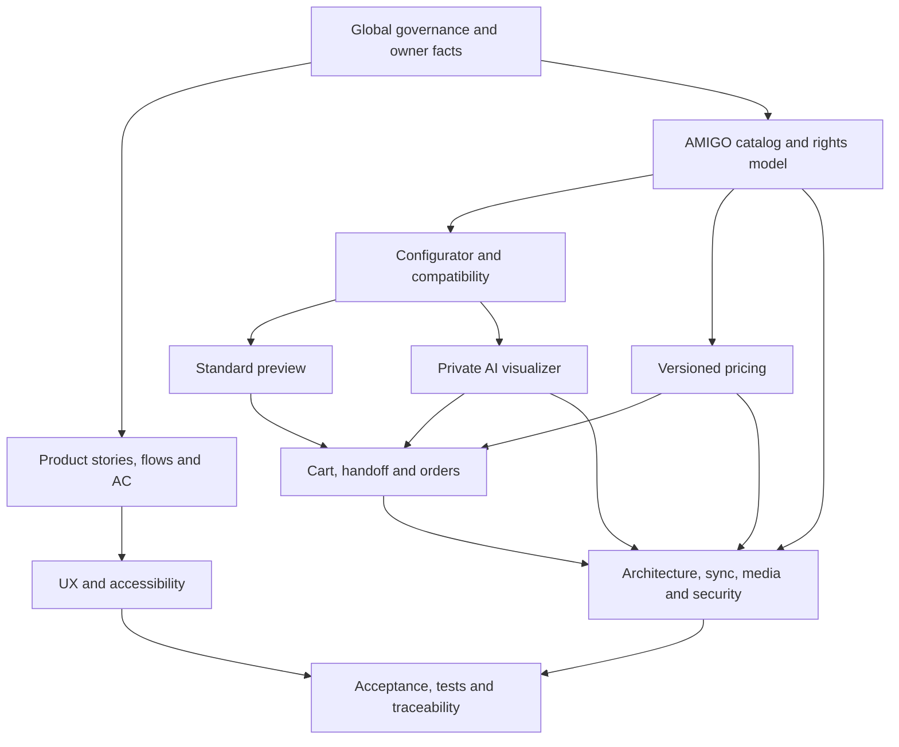

# Roadmap специализированных спецификаций PROJECT_NAME

## 0. Статус

| Поле | Значение |
|---|---|
| Состояние | Phase 1A–1F and Phase 2A complete; Phase 2B live Zebra path passed / family matrix pending; Phase 2C implementation complete / owner Preview pending |
| Версия roadmap | 2.1.0 |
| Дата | 2026-08-13 |
| Entry gate | `PASSED`, [QG-088–QG-111](SPEC_QUALITY_GATE.md) |
| Обязательный комплект 0B | `PASSED`, [QG-112–QG-130](SPEC_QUALITY_GATE.md) |
| Phase 0C readiness | `AUTHORIZED_FOR_PHASE_1A_FOUNDATION`, [QG-131–QG-148](SPEC_QUALITY_GATE.md) |
| Phase 1A acceptance | `PASSED_PHASE_1A_FOUNDATION`, [QG-149–QG-158](SPEC_QUALITY_GATE.md) |
| Phase 1B.1 acceptance | `PASSED_PHASE_1B1_AMIGO_CATALOG_PILOT`, [QG-169–QG-194](SPEC_QUALITY_GATE.md) |
| Phase 1B.2 acceptance | `PASSED_PHASE_1B2_FULL_AMIGO_CATALOG`, [QG-195–QG-230](SPEC_QUALITY_GATE.md) |
| Phase 2C entry | `AUTHORIZED_PHASE_2C_IN_PROGRESS`; implementation delivery is `IMPLEMENTATION_COMPLETE_OWNER_PREVIEW_PENDING`, [QG-601–QG-670](SPEC_QUALITY_GATE.md) |
| Разрешённая implementation | Только Phase 2C presentation/interaction/quality scope по `OWNER-DECISION-024`; merge и production запрещены |

Глобальная база: [GLOBAL_SPEC.md](../specs/GLOBAL_SPEC.md) 0.29.0, [EXTERNAL_SOURCES.md](EXTERNAL_SOURCES.md), [ASSET_RIGHTS_REGISTER.md](ASSET_RIGHTS_REGISTER.md) и [PRICING_SOURCE_POLICY.md](PRICING_SOURCE_POLICY.md). Catalog/price/media provenance остаётся source-backed, активный runtime задают Phase 2A/2B, а `OWNER-DECISION-024` разрешает только финальный presentation/interaction слой по [активному плану](../06-plans/active/PHASE_2C_FINAL_DESIGN_PLAN.md).

Нормативные спецификации находятся только в `docs/specs/`. Gate, реестры, policies, quality strategy, evaluations и ADR остаются в профильных каталогах.

## 1. Зависимости продукта

Открытый TBD блокирует только зависимое утверждение: например, неизвестная формула переводит цену в `PRICE_ON_REQUEST`, но не запрещает просмотр каталога или заявку менеджеру.

## 2. Product artifacts

| Артефакт | Результат | Статус |
|---|---|---|
| [FEATURE_SPEC.md](../specs/01-product/FEATURE_SPEC.md) | Feature portfolio, scope, flows, rules, NFR и delivery boundaries | `CREATED` |
| [USER_STORIES.md](../specs/01-product/USER_STORIES.md) | 40 полных stories для 8 акторов | `CREATED` |
| [USER_FLOWS.md](../specs/01-product/USER_FLOWS.md) | 12 end-to-end и failure flows | `CREATED` |
| [ROLES_PERMISSIONS.md](../specs/01-product/ROLES_PERMISSIONS.md) | Actor/capability/object ownership matrix | `CREATED` |
| [ACCEPTANCE_CRITERIA.md](../specs/01-product/ACCEPTANCE_CRITERIA.md) | 40 проверяемых AC с негативными условиями | `CREATED` |

## 3. Domain artifacts

| Артефакт | Результат | Статус |
|---|---|---|
| [AMIGO_CATALOG_PARITY_SPEC.md](../specs/02-domain/AMIGO_CATALOG_PARITY_SPEC.md) | Functional parity scope и собственные UX/architecture boundaries | `CREATED` |
| [CATALOG_INVENTORY_SPEC.md](../specs/02-domain/CATALOG_INVENTORY_SPEC.md) | Динамическая нормализованная модель каталога, inventory и states | `CREATED` |
| [PRODUCT_CONFIGURATOR_SPEC.md](../specs/02-domain/PRODUCT_CONFIGURATOR_SPEC.md) | Step graph, compatibility, dimensions, revision validation | `CREATED_WITH_TBD` |
| [PRICING_CALCULATOR_SPEC.md](../specs/02-domain/PRICING_CALCULATOR_SPEC.md) | Versioned `PricingProvider`, exact money, override/fallback/parity | `CREATED_WITH_TBD` |
| [STANDARD_INTERIOR_PREVIEW_SPEC.md](../specs/02-domain/STANDARD_INTERIOR_PREVIEW_SPEC.md) | Детерминированный preview на демонстрационной сцене | `CREATED` |
| [AI_WINDOW_VISUALIZER_SPEC.md](../specs/02-domain/AI_WINDOW_VISUALIZER_SPEC.md) | Private geometry-first base и optional AI refinement | `CREATED_WITH_TBD` |
| [CART_CHECKOUT_ORDERS_SPEC.md](../specs/02-domain/CART_CHECKOUT_ORDERS_SPEC.md) | Cart, guest handoff, WhatsApp, measure/order/warranty boundaries | `CREATED_WITH_TBD` |
| [INSTALLMENT_SPEC.md](../specs/02-domain/INSTALLMENT_SPEC.md) | Нейтральная формулировка и manager handoff без финансовых обещаний | `CREATED_WITH_TBD` |
| [AUTH_ACCOUNTS_SPEC.md](../specs/02-domain/AUTH_ACCOUNTS_SPEC.md) | Guest ownership, account projects/history и security contract | `CREATED_WITH_TBD` |
| [ADMIN_PANEL_SPEC.md](../specs/02-domain/ADMIN_PANEL_SPEC.md) | Administrative capabilities, approvals, audit и dangerous actions | `CREATED` |
| [CONTENT_PORTFOLIO_SPEC.md](../specs/02-domain/CONTENT_PORTFOLIO_SPEC.md) | Partner content, own portfolio, badge, labels и revocation | `CREATED` |

`CREATED_WITH_TBD` означает полноценную нормативную boundary/fallback-спеку, но не утверждённую формулу, provider, срок, legal term или business transition.

## 4. UX artifacts

| Артефакт | Результат | Статус |
|---|---|---|
| [INFORMATION_ARCHITECTURE.md](../specs/03-ux/INFORMATION_ARCHITECTURE.md) | Sitemap, navigation, content ownership и task paths | `CREATED` |
| [DESIGN_SYSTEM.md](../specs/03-ux/DESIGN_SYSTEM.md) | Premium interior-tech tokens/components/states | `CREATED` |
| [MOTION_ANIMATION_SPEC.md](../specs/03-ux/MOTION_ANIMATION_SPEC.md) | Starfield, transition, reduced-motion и capability fallback | `CREATED` |
| [SCREEN_SPECS.md](../specs/03-ux/SCREEN_SPECS.md) | Основные desktop/mobile screens и состояния | `CREATED` |
| [RESPONSIVE_SPEC.md](../specs/03-ux/RESPONSIVE_SPEC.md) | Content-driven breakpoints, touch/zoom/narrow behavior | `CREATED` |
| [ACCESSIBILITY_SPEC.md](../specs/03-ux/ACCESSIBILITY_SPEC.md) | WCAG 2.2 AA target, keyboard/AT/focus/errors/motion | `CREATED` |

## 5. Technical and operations artifacts

| Артефакт | Результат | Статус |
|---|---|---|
| [ARCHITECTURE.md](../specs/04-technical/ARCHITECTURE.md) | Vendor-neutral modular application и worker boundaries | `CREATED` |
| [DATA_MODEL.md](../specs/04-technical/DATA_MODEL.md) | Aggregates/entities/versions/relationships/invariants | `CREATED` |
| [API_SPEC.md](../specs/04-technical/API_SPEC.md) | Conceptual contracts, auth, errors, idempotency, versioning | `CREATED` |
| [AMIGO_SYNC_ARCHITECTURE.md](../specs/04-technical/AMIGO_SYNC_ARCHITECTURE.md) | Capture/snapshot/staging/diff/approval/activation/rollback | `CREATED_WITH_TBD` |
| [ASSET_MEDIA_PIPELINE.md](../specs/04-technical/ASSET_MEDIA_PIPELINE.md) | Capture validation, originals, derivatives, rights gate/revoke | `CREATED` |
| [STORAGE_MEDIA.md](../specs/04-technical/STORAGE_MEDIA.md) | Public/private/quarantine zones, grants, delete/backup boundary | `CREATED_WITH_TBD` |
| [AI_PIPELINE.md](../specs/04-technical/AI_PIPELINE.md) | Geometry-first jobs, hard gates, fallback и delete propagation | `CREATED_WITH_TBD` |
| [SECURITY_PRIVACY.md](../specs/04-technical/SECURITY_PRIVACY.md) | Threats, controls, data inventory, consent/retention boundaries | `CREATED_WITH_TBD` |
| [PERFORMANCE.md](../specs/04-technical/PERFORMANCE.md) | Budget governance, critical paths, regional/lab/load validation | `CREATED_WITH_TBD` |
| [OBSERVABILITY.md](../specs/04-technical/OBSERVABILITY.md) | Safe logs/metrics/traces/events/alerts/runbook contracts | `CREATED_WITH_TBD` |
| [DEPLOYMENT.md](../specs/04-technical/DEPLOYMENT.md) | Environments, compatible rollout, migration, rollback/recovery | `CREATED_WITH_TBD` |

## 6. Quality, evaluation и traceability

| Артефакт | Результат | Статус |
|---|---|---|
| [TEST_STRATEGY.md](../quality/TEST_STRATEGY.md) | 40 named critical scenarios + unit/property/contract/E2E/visual/a11y/security/privacy/performance/recovery | `CREATED_WITH_TBD` |
| [AI_EVALUATION_SPEC.md](../evaluations/AI_EVALUATION_SPEC.md) | Rights-cleared benchmark, metrics, hard gates, human/privacy/performance evaluation | `CREATED_WITH_TBD` |
| [TRACEABILITY_MATRIX.md](TRACEABILITY_MATRIX.md) | 18/18 critical chains и 40/40 story→AC→test mappings | `CREATED` |
| [SPEC_QUALITY_GATE.md](SPEC_QUALITY_GATE.md) | Entry/completion 0B, Phase 0C readiness and Phase 1A implementation evidence | `PASSED_PHASE_1A_FOUNDATION` |

## 7. Принятые ADR фазы 0B

| ADR | Решение | Что намеренно отложено |
|---|---|---|
| [ADR-0001](../adr/ADR-0001-application-architecture.md) | Модульное приложение + отдельный worker execution boundary | Framework, database, queue, hosting |
| [ADR-0002](../adr/ADR-0002-amigo-data-integration.md) | Authorized snapshot → staging → diff → approval → activation/rollback | Transport and API/export availability; cadence resolved separately |
| [ADR-0003](../adr/ADR-0003-pricing-engine.md) | Versioned `PricingProvider`, exact money, immutable quote | Формула and active price data; tolerance/minimum scope resolved separately |
| [ADR-0004](../adr/ADR-0004-standard-preview-renderer.md) | Deterministic standard preview, отдельный от AI | Rendering technology и family profiles |
| [ADR-0005](../adr/ADR-0005-ai-visualization-pipeline.md) | Geometry-first base + optional constrained refinement | Provider/model/benchmark/thresholds |
| [ADR-0006](../adr/ADR-0006-media-storage.md) | Local object storage, immutable originals, public/private zones | Vendor, region, TTL, backup periods |

ADR принимают устойчивую границу, а не неподтверждённый vendor. Замена решения оформляется новым ADR со статусом `Supersedes`.

### 7.1. Phase 0C readiness artifacts

| Артефакт | Результат | Статус |
|---|---|---|
| [MVP_SCOPE.md](../06-plans/MVP_SCOPE.md) | 20 обязательных возможностей, cross-cutting gates и 15 post-MVP направлений | `FROZEN_FOR_PLANNING` |
| [SPEC_READINESS_AUDIT.md](../06-plans/SPEC_READINESS_AUDIT.md) | 14 critical specs × 15 dimensions; 0 blocked/contradictory after fixes | `PASS_FOR_1A_REVIEW` |
| [IMPLEMENTATION_ROADMAP.md](../06-plans/IMPLEMENTATION_ROADMAP.md) | Phase 1A–1H с entry/deliverables/tests/risks/DoD/rollback | `APPROVED_SEQUENCE` |
| [PHASE_1A_TECHNOLOGY_EVALUATION.md](../06-plans/PHASE_1A_TECHNOLOGY_EVALUATION.md) | Vendor-neutral Foundation stack and alternatives | `ADR_ACCEPTED` |
| [PHASE_1A_FOUNDATION_PLAN.md](../06-plans/active/PHASE_1A_FOUNDATION_PLAN.md) | Detailed Foundation execution plan and commit sequence | `COMPLETED` |
| [PHASE_1A_FOUNDATION_REPORT.md](../06-plans/completed/PHASE_1A_FOUNDATION_REPORT.md) | Actual implementation, commits, verification, skipped scope and acceptance | `PASSED_PHASE_1A_FOUNDATION` |
| [PHASE_1B1_AMIGO_CATALOG_PILOT_REPORT.md](../06-plans/completed/PHASE_1B1_AMIGO_CATALOG_PILOT_REPORT.md) | Real pilot, versions, media, recovery and CI evidence | `PASSED_PHASE_1B1_AMIGO_CATALOG_PILOT` |
| [PHASE_1B2_FULL_AMIGO_CATALOG_PLAN.md](../06-plans/active/PHASE_1B2_FULL_AMIGO_CATALOG_PLAN.md) | Stable full discovery/import/media/price/review/bulk/public/admin/performance execution contract | `COMPLETED` |
| [PHASE_1B2_FULL_AMIGO_CATALOG_REPORT.md](../06-plans/completed/PHASE_1B2_FULL_AMIGO_CATALOG_REPORT.md) | Real manifest/version/media/governance/restart/no-op/public/CI acceptance evidence | `PASSED_PHASE_1B2_FULL_AMIGO_CATALOG` |

### 7.2. Accepted Phase 1A ADR

| ADR | Принятое решение | Boundary |
|---|---|---|
| [ADR-0007](../adr/ADR-0007-foundation-application-stack.md) | Node/TypeScript/pnpm/Next.js modular web/BFF + worker/test baseline | Phase 1A only; Windows 11 first-class |
| [ADR-0008](../adr/ADR-0008-postgresql-and-migration-safety.md) | PostgreSQL/Prisma, reviewed versioned migrations, expand/contract and compensation/restore | Foundation schema only |
| [ADR-0009](../adr/ADR-0009-object-storage-and-background-jobs.md) | S3-compatible object port and PostgreSQL-backed durable jobs | Local adapter/worker; production providers later |
| [ADR-0010](../adr/ADR-0010-identity-secrets-and-observability-boundary.md) | Identity port, managed secret boundary and OTLP | Synthetic identity; public identity/provider later |

## 8. Незакрытые зависимости по implementation gate

- **Phase 1A:** завершена и проверена; Foundation остаётся неизменной основой.
- **Phase 1B.1:** завершена и проверена; v1 сохранена как immutable rollback target.
- **Phase 1B.2:** завершена и проверена; accepted v2 содержит полный текущий public-page inventory, 1 655 public variants и 2 818 approved local media objects. Official export aspect `TBD-SOURCE-AMIGO-002` остаётся открытым.
- **До Phase 1C:** active catalog PriceVersion v2 уже существует; по-прежнему нужны formula/rounding/compatibility/dimensions/source-region inputs. Activation roles, parity tolerance и per-item minimum решены, но calculator не реализован.
- **До Phase 1D:** approved `SceneProfile`, renderer profiles/assets and visual baselines (`TBD-PREVIEW-001`).
- **До Phase 1E/1F:** legal/privacy/retention, business state mapping, identity/recovery and operational roles.
- **До Phase 1G:** rights-cleared AI benchmark, provider/model/region/contract, upload limits, TTL, thresholds and cost caps.
- **До Phase 1H:** production topology/regions, network evidence, performance/SLO, RPO/RTO, backup/restore and launch legal review.
- **В Phase 2C:** финальные бренд/логотип остаются `TBD-DESIGN-001`; Preview использует нейтральный settings-backed fallback. Remote Supabase/Polza evidence остаётся отдельным live gate, а private-media/legal/production вопросы не закрываются визуальным редизайном.

Все вопросы имеют `TBD-*` в [OPEN_QUESTIONS.md](OPEN_QUESTIONS.md); новый факт сначала закрывает канонический TBD и обновляет specs/changelog/tests.

## 9. Implementation sequence after Phase 0C

1. Product Owner принял ADR-0007–0010 и письменно разрешил Phase 1A 2026-08-02.
2. Phase 1A выполнена по [завершённому плану](../06-plans/active/PHASE_1A_FOUNDATION_PLAN.md) без AMIGO import и business features; результат зафиксирован в [completion report](../06-plans/completed/PHASE_1A_FOUNDATION_REPORT.md).
3. `OWNER-DECISION-010` разрешил и завершил только Phase 1B.1 по [stable plan](../06-plans/active/PHASE_1B1_AMIGO_CATALOG_PILOT_PLAN.md) и [report](../06-plans/completed/PHASE_1B1_AMIGO_CATALOG_PILOT_REPORT.md).
4. Subsequent written decisions completed Phase 1C–1F and Phase 2A; Phase 2B implementation is complete/live pending under `OWNER-DECISION-023` and ADR-0014.
5. `OWNER-DECISION-024` now authorizes only Phase 2C from target-main `bdaa053`; its active plan and QG-601–670 control final presentation, verification and Preview delivery.
6. Закрываются только те P0/P1 business/data/privacy вопросы, от которых зависит выбранный slice; safe fallback не выдаётся за решение.
7. Source/hosting/AI evaluations используют только разрешённые данные и завершаются ADR до provider commitment; Phase 2C does not choose or replace a provider.

## 10. Правило изменения roadmap

Порядок MAY уточняться, если активный план фиксирует результат и зависимости, но нельзя обходить gate или скрывать TBD. Содержательное изменение поведения сначала или одновременно обновляет каноническую спецификацию и `CHANGELOG.md`.

## 11. История

| Версия | Дата | Изменение |
|---|---|---|
| 0.1.0 | 2026-08-02 | Определён первоначальный порядок будущих специализированных спецификаций. |
| 0.2.0 | 2026-08-02 | Добавлен обязательный owner-requested модульный комплект 0B. |
| 1.0.0 | 2026-08-02 | Roadmap синхронизирован с фактически созданными 33 specs, quality/evaluation, traceability и 6 ADR; следующий кодовый этап не разрешён. |
| 1.1.0 | 2026-08-02 | Добавлены Phase 0C MVP/readiness artifacts, proposed ADR-0007–0010, P0 gates и обязательная sequence Phase 1A–1H без автоматического старта. |
| 1.2.0 | 2026-08-02 | QG-147/148 закрыты, ADR-0007–0010 accepted, семь owner P0 resolved; только Phase 1A переведена в authorized/in-progress. |
| 1.3.0 | 2026-08-02 | Phase 1A plan и report получили completion evidence, QG-149–158 passed; roadmap остановлен перед Phase 1B до нового письменного решения. |
| 1.4.0 | 2026-08-02 | Глобальная база обновлена до 0.8.0 с authority matrix `OWNER-DECISION-008`; Phase 1B entry/import evidence и transition hold не изменены. |
| 1.5.0 | 2026-08-02 | Глобальная база обновлена до 0.9.0 с PostgreSQL public-serving contract `OWNER-DECISION-009`; Phase 1B entry/import evidence и transition hold не изменены. |
| 1.6.0 | 2026-08-02 | `OWNER-DECISION-010` разрешил только Phase 1B.1 с dated transport evidence/32-ID plan; Phase 1B.2/1C+ и production сохранены на hold. |
| 1.7.0 | 2026-08-03 | Phase 1B.1 completion report and QG-169–194 recorded; global source advanced to 0.12.0 and no-next-phase hold preserved. |
| 1.8.0 | 2026-08-03 | `OWNER-DECISION-012`, QG-195–202 and active Phase 1B.2 plan authorize only full catalog expansion; Phase 1C+ and production remain gated. |
| 1.9.0 | 2026-08-04 | Phase 1B.2 completion report and QG-203–230 record accepted manifest, active v2 versions, media/restart/no-op/public/CI evidence; no next phase is authorized. |
| 2.0.0 | 2026-08-12 | Roadmap synchronized with completed Phase 1C–2A, complete/live-pending Phase 2B and the separately authorized Phase 2C final-design plan/QG-601–670; provider/data/production gates remain visible. |
