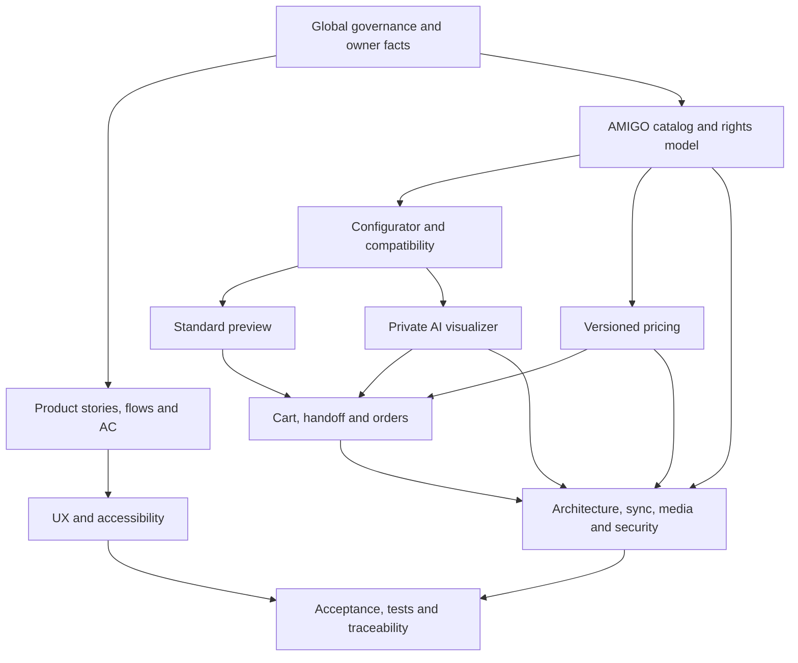

# Roadmap специализированных спецификаций PROJECT_NAME

## 0. Статус

| Поле | Значение |
|---|---|
| Состояние | Phase 0B завершена; transition hold до нового письменного решения владельца |
| Версия roadmap | 1.0.0 |
| Дата | 2026-08-02 |
| Entry gate | `PASSED`, [QG-088–QG-111](SPEC_QUALITY_GATE.md) |
| Обязательный комплект 0B | `PASSED`, [QG-112–QG-130](SPEC_QUALITY_GATE.md) |
| Production implementation | Запрещена до отдельного письменного решения после completion gate |

Глобальная база: [GLOBAL_SPEC.md](../specs/GLOBAL_SPEC.md), [EXTERNAL_SOURCES.md](EXTERNAL_SOURCES.md), [ASSET_RIGHTS_REGISTER.md](ASSET_RIGHTS_REGISTER.md) и [PRICING_SOURCE_POLICY.md](PRICING_SOURCE_POLICY.md). Поручение владельца начать 0B является письменным решением о документации, но не разрешением писать код, импортировать каталог или выбирать поставщиков без evaluations/ADR.

Нормативные спецификации находятся только в `docs/specs/`. Gate, реестры, policies, quality strategy, evaluations и ADR остаются в профильных каталогах.

## 1. Зависимости продукта

Открытый TBD блокирует только зависимое утверждение: например, неизвестная формула переводит цену в `PRICE_ON_REQUEST`, но не запрещает просмотр каталога или заявку менеджеру.

## 2. Product artifacts

| Артефакт | Результат | Статус |
|---|---|---|
| [FEATURE_SPEC.md](../specs/01-product/FEATURE_SPEC.md) | Feature portfolio, scope, flows, rules, NFR и delivery boundaries | `CREATED` |
| [USER_STORIES.md](../specs/01-product/USER_STORIES.md) | 40 полных stories для 8 акторов | `CREATED` |
| [USER_FLOWS.md](../specs/01-product/USER_FLOWS.md) | 12 end-to-end и failure flows | `CREATED` |
| [ROLES_PERMISSIONS.md](../specs/01-product/ROLES_PERMISSIONS.md) | Actor/capability/object ownership matrix | `CREATED` |
| [ACCEPTANCE_CRITERIA.md](../specs/01-product/ACCEPTANCE_CRITERIA.md) | 40 проверяемых AC с негативными условиями | `CREATED` |

## 3. Domain artifacts

| Артефакт | Результат | Статус |
|---|---|---|
| [AMIGO_CATALOG_PARITY_SPEC.md](../specs/02-domain/AMIGO_CATALOG_PARITY_SPEC.md) | Functional parity scope и собственные UX/architecture boundaries | `CREATED` |
| [CATALOG_INVENTORY_SPEC.md](../specs/02-domain/CATALOG_INVENTORY_SPEC.md) | Динамическая нормализованная модель каталога, inventory и states | `CREATED` |
| [PRODUCT_CONFIGURATOR_SPEC.md](../specs/02-domain/PRODUCT_CONFIGURATOR_SPEC.md) | Step graph, compatibility, dimensions, revision validation | `CREATED_WITH_TBD` |
| [PRICING_CALCULATOR_SPEC.md](../specs/02-domain/PRICING_CALCULATOR_SPEC.md) | Versioned `PricingProvider`, exact money, override/fallback/parity | `CREATED_WITH_TBD` |
| [STANDARD_INTERIOR_PREVIEW_SPEC.md](../specs/02-domain/STANDARD_INTERIOR_PREVIEW_SPEC.md) | Детерминированный preview на демонстрационной сцене | `CREATED` |
| [AI_WINDOW_VISUALIZER_SPEC.md](../specs/02-domain/AI_WINDOW_VISUALIZER_SPEC.md) | Private geometry-first base и optional AI refinement | `CREATED_WITH_TBD` |
| [CART_CHECKOUT_ORDERS_SPEC.md](../specs/02-domain/CART_CHECKOUT_ORDERS_SPEC.md) | Cart, guest handoff, WhatsApp, measure/order/warranty boundaries | `CREATED_WITH_TBD` |
| [INSTALLMENT_SPEC.md](../specs/02-domain/INSTALLMENT_SPEC.md) | Нейтральная формулировка и manager handoff без финансовых обещаний | `CREATED_WITH_TBD` |
| [AUTH_ACCOUNTS_SPEC.md](../specs/02-domain/AUTH_ACCOUNTS_SPEC.md) | Guest ownership, account projects/history и security contract | `CREATED_WITH_TBD` |
| [ADMIN_PANEL_SPEC.md](../specs/02-domain/ADMIN_PANEL_SPEC.md) | Administrative capabilities, approvals, audit и dangerous actions | `CREATED` |
| [CONTENT_PORTFOLIO_SPEC.md](../specs/02-domain/CONTENT_PORTFOLIO_SPEC.md) | Partner content, own portfolio, badge, labels и revocation | `CREATED` |

`CREATED_WITH_TBD` означает полноценную нормативную boundary/fallback-спеку, но не утверждённую формулу, provider, срок, legal term или business transition.

## 4. UX artifacts

| Артефакт | Результат | Статус |
|---|---|---|
| [INFORMATION_ARCHITECTURE.md](../specs/03-ux/INFORMATION_ARCHITECTURE.md) | Sitemap, navigation, content ownership и task paths | `CREATED` |
| [DESIGN_SYSTEM.md](../specs/03-ux/DESIGN_SYSTEM.md) | Premium interior-tech tokens/components/states | `CREATED` |
| [MOTION_ANIMATION_SPEC.md](../specs/03-ux/MOTION_ANIMATION_SPEC.md) | Starfield, transition, reduced-motion и capability fallback | `CREATED` |
| [SCREEN_SPECS.md](../specs/03-ux/SCREEN_SPECS.md) | Основные desktop/mobile screens и состояния | `CREATED` |
| [RESPONSIVE_SPEC.md](../specs/03-ux/RESPONSIVE_SPEC.md) | Content-driven breakpoints, touch/zoom/narrow behavior | `CREATED` |
| [ACCESSIBILITY_SPEC.md](../specs/03-ux/ACCESSIBILITY_SPEC.md) | WCAG 2.2 AA target, keyboard/AT/focus/errors/motion | `CREATED` |

## 5. Technical and operations artifacts

| Артефакт | Результат | Статус |
|---|---|---|
| [ARCHITECTURE.md](../specs/04-technical/ARCHITECTURE.md) | Vendor-neutral modular application и worker boundaries | `CREATED` |
| [DATA_MODEL.md](../specs/04-technical/DATA_MODEL.md) | Aggregates/entities/versions/relationships/invariants | `CREATED` |
| [API_SPEC.md](../specs/04-technical/API_SPEC.md) | Conceptual contracts, auth, errors, idempotency, versioning | `CREATED` |
| [AMIGO_SYNC_ARCHITECTURE.md](../specs/04-technical/AMIGO_SYNC_ARCHITECTURE.md) | Capture/snapshot/staging/diff/approval/activation/rollback | `CREATED_WITH_TBD` |
| [ASSET_MEDIA_PIPELINE.md](../specs/04-technical/ASSET_MEDIA_PIPELINE.md) | Capture validation, originals, derivatives, rights gate/revoke | `CREATED` |
| [STORAGE_MEDIA.md](../specs/04-technical/STORAGE_MEDIA.md) | Public/private/quarantine zones, grants, delete/backup boundary | `CREATED_WITH_TBD` |
| [AI_PIPELINE.md](../specs/04-technical/AI_PIPELINE.md) | Geometry-first jobs, hard gates, fallback и delete propagation | `CREATED_WITH_TBD` |
| [SECURITY_PRIVACY.md](../specs/04-technical/SECURITY_PRIVACY.md) | Threats, controls, data inventory, consent/retention boundaries | `CREATED_WITH_TBD` |
| [PERFORMANCE.md](../specs/04-technical/PERFORMANCE.md) | Budget governance, critical paths, regional/lab/load validation | `CREATED_WITH_TBD` |
| [OBSERVABILITY.md](../specs/04-technical/OBSERVABILITY.md) | Safe logs/metrics/traces/events/alerts/runbook contracts | `CREATED_WITH_TBD` |
| [DEPLOYMENT.md](../specs/04-technical/DEPLOYMENT.md) | Environments, compatible rollout, migration, rollback/recovery | `CREATED_WITH_TBD` |

## 6. Quality, evaluation и traceability

| Артефакт | Результат | Статус |
|---|---|---|
| [TEST_STRATEGY.md](../quality/TEST_STRATEGY.md) | 40 named critical scenarios + unit/property/contract/E2E/visual/a11y/security/privacy/performance/recovery | `CREATED_WITH_TBD` |
| [AI_EVALUATION_SPEC.md](../evaluations/AI_EVALUATION_SPEC.md) | Rights-cleared benchmark, metrics, hard gates, human/privacy/performance evaluation | `CREATED_WITH_TBD` |
| [TRACEABILITY_MATRIX.md](TRACEABILITY_MATRIX.md) | 18/18 critical chains и 40/40 story→AC→test mappings | `CREATED` |
| [SPEC_QUALITY_GATE.md](SPEC_QUALITY_GATE.md) | Entry и completion evidence | `PASSED` |

## 7. Принятые ADR фазы 0B

| ADR | Решение | Что намеренно отложено |
|---|---|---|
| [ADR-0001](../adr/ADR-0001-application-architecture.md) | Модульное приложение + отдельный worker execution boundary | Framework, database, queue, hosting |
| [ADR-0002](../adr/ADR-0002-amigo-data-integration.md) | Authorized snapshot → staging → diff → approval → activation/rollback | Transport, API/export availability, cadence |
| [ADR-0003](../adr/ADR-0003-pricing-engine.md) | Versioned `PricingProvider`, exact money, immutable quote | Формула, active price data, tolerance |
| [ADR-0004](../adr/ADR-0004-standard-preview-renderer.md) | Deterministic standard preview, отдельный от AI | Rendering technology и family profiles |
| [ADR-0005](../adr/ADR-0005-ai-visualization-pipeline.md) | Geometry-first base + optional constrained refinement | Provider/model/benchmark/thresholds |
| [ADR-0006](../adr/ADR-0006-media-storage.md) | Local object storage, immutable originals, public/private zones | Vendor, region, TTL, backup periods |

ADR принимают устойчивую границу, а не неподтверждённый vendor. Замена решения оформляется новым ADR со статусом `Supersedes`.

## 8. Незакрытые зависимости перед реализацией

- Реальный полный AMIGO inventory, разрешённый transport/export, cadence и freshness SLA.
- Active price snapshot, точная формула/округление/overrides/minimum и owner-approved parity tolerance/cases.
- Compatibility, dimension constraints и отдельные сложные family profiles.
- Customer/admin authentication model, session/recovery и public/internal order-state mapping.
- Legal/privacy basis, consent, retention/delete periods, subprocessors и contracts.
- Rights-cleared AI benchmark, metrics/thresholds, provider/model/region/cost and failure policy.
- Hosting/database/storage/queue/network topology, performance budgets, SLO, RPO/RTO и backup retention.
- Юридические условия рассрочки, договорная цена, warranty exclusions и operational workflow.

Все вопросы имеют `TBD-*` в [OPEN_QUESTIONS.md](OPEN_QUESTIONS.md); новый факт сначала закрывает канонический TBD и обновляет specs/changelog/tests.

## 9. Порядок после completion gate

1. Владелец письменно решает, начинать ли следующую фазу; автоматического перехода нет.
2. Закрываются P0/P1 business/data/privacy вопросы, от которых зависит выбранный implementation slice.
3. Выполняются необходимые source/hosting/AI evaluations на разрешённых данных.
4. Конкретные технологические решения оформляются отдельными ADR.
5. Составляется ограниченный implementation plan с migration/rollback/test links.
6. Только после отдельного разрешения создаются package, application code, schema, importer, storage, auth или AI integration.

## 10. Правило изменения roadmap

Порядок MAY уточняться, если активный план фиксирует результат и зависимости, но нельзя обходить gate или скрывать TBD. Содержательное изменение поведения сначала или одновременно обновляет каноническую спецификацию и `CHANGELOG.md`.

## 11. История

| Версия | Дата | Изменение |
|---|---|---|
| 0.1.0 | 2026-08-02 | Определён первоначальный порядок будущих специализированных спецификаций. |
| 0.2.0 | 2026-08-02 | Добавлен обязательный owner-requested модульный комплект 0B. |
| 1.0.0 | 2026-08-02 | Roadmap синхронизирован с фактически созданными 33 specs, quality/evaluation, traceability и 6 ADR; следующий кодовый этап не разрешён. |
