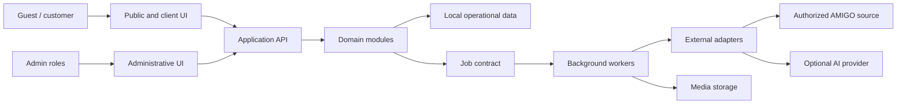

# ADR-0001: Границы архитектуры приложения PROJECT_NAME

## Метаданные

| Поле | Значение |
|---|---|
| Статус | Accepted — архитектурная граница; технологии и hosting не выбраны |
| Дата решения | 2026-08-02 |
| Решение принято | Владелец продукта в рамках поручения Phase 0B |
| Область | Web application, domain modules, background workers, external adapters |
| Заменяет | — |

## Контекст

PROJECT_NAME должен иметь собственные frontend, backend, интерфейсы и архитектуру, поддерживать динамический каталог AMIGO, конфигуратор, расчёты, два визуализатора, заявки, аккаунты и административные процессы. Публичный сайт не должен зависеть от доступности AMIGO или AI-провайдера во время каждого запроса. При этом Phase 0B запрещает выбирать технологический стек без сравнительных документов и не разрешает production-реализацию.

## Драйверы

- автономность клиентского пути при сбое AMIGO, AI или канала связи;
- воспроизводимость цены, конфигурации и заказа по версиям;
- чёткая изоляция приватных фотографий и административных операций;
- возможность заменить внешний адаптер или AI-провайдера;
- независимое масштабирование длительных sync/media/AI-задач;
- постепенная реализация без преждевременного разбиения на микросервисы;
- тестируемые доменные границы и отказоустойчивые fallback.

## Рассмотренные варианты

### A. Клиент напрямую обращается ко всем внешним системам

Отклонён: раскрывает интеграционные детали, усложняет права и делает основной путь зависимым от внешней доступности.

### B. Микросервисы для каждого домена с первого релиза

Отклонён для начальной реализации: увеличивает операционную стоимость и распределённую сложность без подтверждённой нагрузки.

### C. Модульное приложение с отдельным исполнением фоновых задач

Принят: домены изолированы контрактами внутри единой архитектурной границы; длительные и повторяемые операции исполняются worker-контуром через абстракцию очереди/заданий.

## Решение

1. Архитектура MUST быть модульной и разделять как минимум catalog, configuration, pricing, preview, AI, cart/order, identity, content, admin, sync, media и observability.
2. Публичный интерфейс MUST обращаться к собственному application API, а не напрямую к AMIGO, хранилищу или AI-провайдеру.
3. Sync, media derivatives, AI processing, retention/delete и тяжёлые export/recovery операции MUST иметь асинхронный job contract с идемпотентностью, retry policy, статусом и audit trail.
4. Модульный монолит является исходной deployment boundary; выделение сервиса допускается только после доказанного требования нагрузки, изоляции или compliance и нового ADR.
5. Доменная логика MUST не зависеть от конкретного web framework, database, object storage, queue или AI SDK.
6. Интеграции MUST находиться за адаптерами и иметь timeout, классифицированные ошибки, наблюдаемость и безопасную деградацию.
7. Клиентский каталог и сохранённые расчёты MUST обслуживаться из локально активированных данных.
8. Administrative plane MUST быть отделён от public/client plane правами, маршрутами, аудитом и усиленной аутентификацией.
9. Технологический стек, hosting, database, queue и аналитика остаются `BLOCKED_BY_TBD` до сравнений и соответствующих ADR.

## Логические контуры

Диаграмма концептуальна и не выбирает технологию транспорта или хранения.

## Последствия

Положительные: core funnel не зависит от live AMIGO; версии и адаптеры тестируются отдельно; фоновые сбои не блокируют навигацию; сохраняется путь к выделению сервисов.

Отрицательные: нужны job state machine, идемпотентность, outbox/эквивалентная доставка и операционные runbook; модульные границы требуют дисциплины даже внутри одного deployment.

## Риски и меры

| Риск | Мера |
|---|---|
| Скрытое сцепление модулей через общие таблицы | Владение данными модулем, application contracts, архитектурные тесты |
| Двойное выполнение job | Idempotency key, version check, атомарный transition |
| Очередь недоступна | Durable handoff, retry, visible degraded state |
| Админский endpoint попадает в public plane | Отдельные permissions, deny-by-default, security tests |
| Преждевременный vendor lock-in | Ports/adapters и provider-neutral domain objects |

## Откат и supersede

До реализации решение отменяется новым ADR. После реализации модули MAY выделяться постепенно через совместимые контракты; данные и jobs мигрируются с dual-read/write только по отдельному migration plan. ADR не разрешает необратимое разбиение.

## Связанные документы и требования

- [ARCHITECTURE.md](../specs/04-technical/ARCHITECTURE.md)
- [API_SPEC.md](../specs/04-technical/API_SPEC.md)
- [DATA_MODEL.md](../specs/04-technical/DATA_MODEL.md)
- [DEPLOYMENT.md](../specs/04-technical/DEPLOYMENT.md)
- `NFR-ARCH-001`–`NFR-ARCH-012`, `NFR-SEC-001`, `NFR-PERF-001`, `AMIGO-SYNC-001`
- Open: `TBD-INFRA-001`–`009`, `TBD-ACCOUNT-001`–`003`

## История

| Дата | Изменение |
|---|---|
| 2026-08-02 | Принята модульная vendor-neutral граница с отдельным worker-контуром; стек отложен. |
