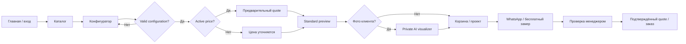
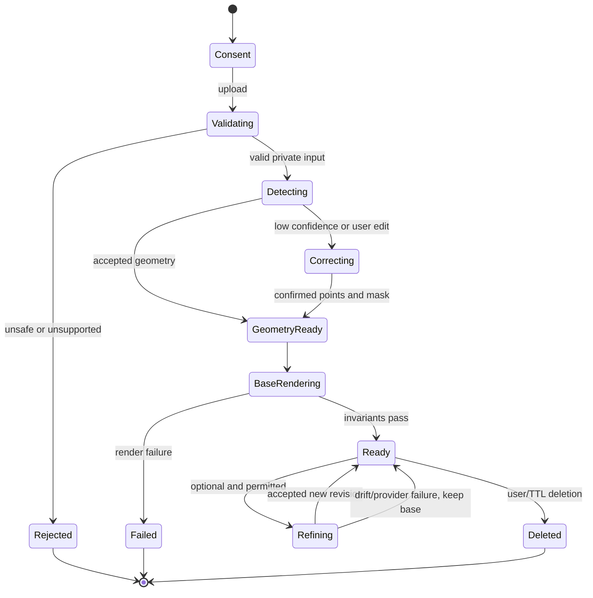
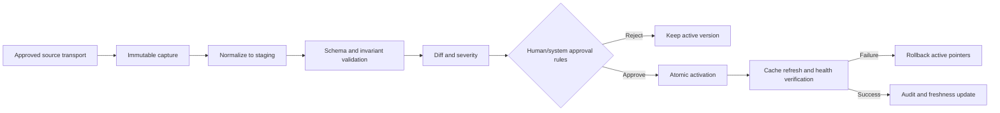

# User flows PROJECT_NAME

## 0. Метаданные

| Поле | Значение |
|---|---|
| Статус | Draft 0B — основные и альтернативные flows определены |
| Версия | 0.2.0 |
| Дата | 2026-08-02 |
| Stories | [USER_STORIES.md](USER_STORIES.md) |
| Acceptance | [ACCEPTANCE_CRITERIA.md](ACCEPTANCE_CRITERIA.md) |

## 1. Назначение и общие правила

Документ задаёт последовательность экранов, решений, state changes и safe fallbacks. Он не задаёт UI pixels, price formulas или provider APIs. Общие инварианты:

- **PFLOW-001 — MUST:** пользователь может перейти от каталога к ручному контакту даже при недоступности price/AI/source.
- **PFLOW-002 — MUST:** каждый шаг показывает, какие данные подтверждены, предварительны, устарели или требуют менеджера.
- **PFLOW-003 — MUST:** изменение конфигурации создаёт новую revision и повторно валидирует price/preview/cart dependencies.
- **PFLOW-004 — MUST:** private photo никогда не передаётся в обычный catalog/analytics/WhatsApp payload.
- **PFLOW-005 — MUST:** back/refresh/retry не создаёт duplicate lead, order, quote activation или sync run.
- **PFLOW-006 — MUST:** error state сохраняет безопасные введённые данные, если их retention разрешён.
- **PFLOW-007 — MUST:** keyboard/reduced-motion route даёт ту же функциональную цель.
- **PFLOW-008 — MUST:** `BLOCKED_BY_TBD` переводит flow в явный manual/review path.

## 2. Сквозная карта клиента

## 3. Flow F-01: discovery → catalog

| Шаг | Actor | Действие / состояние | Validation | Failure / alternative |
|---:|---|---|---|---|
| 1 | Гость | Открывает entry page; может skip starfield | Motion preference | Reduced motion сразу показывает hero |
| 2 | Система | Показывает local value, partner statement, бесплатные услуги и neutral installment text | Content publication status | Missing badge → text fallback |
| 3 | Гость | Выбирает category/search | Category `ACTIVE` | Unknown query → suggestions + contact |
| 4 | Система | Показывает systems/materials с independent states | Publication and rights | Missing price/availability не скрывается за CTA buy |
| 5 | Гость | Открывает detail/configurator | Orderability or inquiry route | Not ready → manager inquiry |

Связи: `US-GUEST-001/002`, `AC-AMIGO-PARITY-001`, `AC-CATALOG-001`.

## 4. Flow F-02: product configuration

| Шаг | Данные | Результат | Edge case |
|---:|---|---|---|
| 1 | `familyId` | Допустимые systems | Source family без local mapping скрыта/neutral inquiry |
| 2 | `systemId` | Models/mountings | Alias resolves stable ID |
| 3 | `modelId`, mounting | Dimension schema/options | Matrix missing → manual review |
| 4 | Width/height/quantity | Normalized draft | Unit/rounding unknown → no quote |
| 5 | Search/filters | Compatible materials only | Unknown property not positive match |
| 6 | Material variant | Real mapped asset and source category | Missing approved asset blocks public selection |
| 7 | Hardware/control/options | Dependency graph recalculated | Removed option gets explanation |
| 8 | Validate | `VALID` or field errors | Multiple errors announced as summary + inline |
| 9 | Request quote | Price or `UNAVAILABLE` | Never value `0` as fallback |
| 10 | Add/preview | Immutable configuration revision | Stale tab uses version conflict |

## 5. Flow F-03: preliminary price

1. System receives `configurationRevisionId` and calculation context.
2. It resolves active verified PriceVersion effective for calculation time/region.
3. It validates every required input, rule, material/source category and service line.
4. It calculates using exact decimal/minor units and creates breakdown.
5. It stores immutable input/rule/version/output snapshot.
6. It returns `PRELIMINARY` label and freshness; historical quote remains unchanged.

Alternatives:

- missing version/rule → `UNAVAILABLE`, configuration stays usable;
- version switches during request → one consistent version or retry, never mixed rules;
- local override expired/unapproved → ignore it and use verified source price if applicable;
- minimum 1500 applies per separately manufactured item by `OWNER-DECISION-003`, but remains disabled until Phase 1C pricing gates;
- source unavailable → active local snapshot may be used within approved staleness policy, otherwise manual quote.

Связи: `US-GUEST-004`, `US-CUSTOMER-003`, `US-ADMIN-004`.

## 6. Flow F-04: standard interior preview

| Шаг | Действие | State | Failure fallback |
|---:|---|---|---|
| 1 | Resolve configuration/material/scene profile | `REQUESTED` | Unsupported system → descriptive preview unavailable |
| 2 | Load local approved assets | `LOADING` | Never hotlink source image |
| 3 | Apply geometry, pattern scale, hardware/control | `RENDERING` | Missing mapping → block incorrect texture |
| 4 | User changes position/scene/light where supported | New revision | Preserve configuration selection |
| 5 | Export/share-safe image or screenshot reference | `READY` | Accessibility textual summary always present |

Standard preview does not accept client photos and does not call generative AI. It can be cached by configuration/scene/asset revisions without leaking private data.

## 7. Flow F-05: client-photo AI visualizer

Key checkpoints:

- validate real MIME/signature/size/orientation/malware and strip prohibited metadata;
- detect one or more windows/створки, but user chooses target and may correct at least four points;
- build masks for glass/product/protected frame/handle/foreground occlusion;
- render exact selected material asset and family geometry;
- compare geometry/material/protected-region invariants;
- only then optionally submit minimal data to approved refinement provider;
- save outputs privately and attach an opaque reference, not an object URL.

## 8. Flow F-06: cart/project → WhatsApp/measurement

| Step | Cart behavior | Handoff behavior |
|---:|---|---|
| 1 | Create/reuse guest cart | Token is opaque, scoped and expiring |
| 2 | Add independent item revision/quantity | Price status stays per item |
| 3 | Edit/duplicate/remove | No cross-item side effects |
| 4 | Review summary and service statement | Stale quotes explicitly marked |
| 5 | Choose consultation/measurement/installment interest | Only approved neutral claims |
| 6 | Create server-side share-safe snapshot/reference | Exclude photo URLs, internal notes/rules |
| 7 | Open editable WhatsApp message | Failure shows confirmed contact/reference |
| 8 | Manager verifies and creates/transitions lead | Handoff itself is not order confirmation |

## 9. Flow F-07: guest → account

1. Guest works without registration using scoped project/cart ownership token.
2. User authenticates through an ADR-approved method.
3. System proves both account identity and guest token ownership.
4. Attach operation is idempotent; existing ownership conflict is denied without disclosure.
5. Quote/configuration/visualization revisions remain immutable.
6. Guest token is rotated/revoked after successful claim according to policy.

Recovery, session duration, MFA and identity method remain linked to `TBD-ACCOUNT-*`; no insecure default is assumed.

## 10. Flow F-08: manager lead/order

| From | Action | To | Guard / audit |
|---|---|---|---|
| — | Accept handoff/form | `CREATED` | Idempotency key and consent/contact evidence |
| `CREATED` | Start review | `IN_REVIEW` | Manager permission |
| `IN_REVIEW` | Request/schedule measurement | `MEASUREMENT_PENDING` | Region and approved scheduling process |
| `MEASUREMENT_PENDING` | Record verified inputs | `QUOTED` | New quote revision and price authorization |
| `QUOTED` | Client/business confirmation | `CONFIRMED` | Evidence; no automatic installment approval |
| `CONFIRMED` | Start fulfilment | `IN_FULFILLMENT` | Operational policy TBD |
| `IN_FULFILLMENT` | Complete | `COMPLETED` | Handover/install evidence TBD |
| Any allowed | Cancel with reason | `CANCELLED` | Role/reason/client notification policy |

Exact workflow remains `BLOCKED_BY_TBD-BIZ-004`; this table is a proposed minimum and not an operational promise.

## 11. Flow F-09: content publication and revocation

1. Register source/original and cryptographic hash.
2. Record rightsholder, permission basis/scope/date, restrictions and evidence reference.
3. Map exact domain entity and `assetRole`.
4. Create derivatives with parent/hash/transform metadata.
5. Validate content, PII, attribution and brand notes.
6. Separate actor approves rights and publication as policy requires.
7. Delivery uses local managed storage; no hotlink.
8. Revocation sets `PUBLICATION_BLOCKED`, invalidates all delivery references/caches and traverses derivatives.
9. Retention/delete handles original, derivatives, tombstone and audit separately.

## 12. Flow F-10: AMIGO catalog/price sync

No step assumes a public API. Supported future transports are official partner API/cabinet/export/file, permission-verified public-page import or controlled manual import, in this priority order. Transport choice needs evidence and ADR.

## 13. Flow F-11: administrative approval

| Operation | Pre-check | Approval | Commit | Recovery |
|---|---|---|---|---|
| Catalog mapping/state | Source/diff/impact | Catalog role | Optimistic version + audit | Restore prior state |
| Price version | Validation/parity/effective date | Price approver; separation where required | Atomic pointer | Previous active version |
| Media publication | Rights/mapping/derivatives | Content/right role | Publication record | Block/invalidate/delete |
| Partner badge | Permission/brand notes | Owner/content role | Surface-specific version | Text fallback |
| User/role change | Identity/least privilege | Authorized owner/admin | Session revocation + audit | Revoke role/session |

## 14. Flow F-12: failure and recovery

| Dependency | User path | Data behavior | Alert/runbook |
|---|---|---|---|
| AMIGO source | Local active catalog continues; freshness visible | No destructive overwrite | Sync failure/staleness |
| Pricing | Save configuration, manual quote | No fake/zero price | Price owner |
| Standard renderer | Text/product image fallback | Keep selections | Render error rate |
| AI/CV/refinement | Manual geometry/base render/no AI | No public exposure | Queue/provider/quality |
| Object storage | Block upload/output; catalog text remains | Retry idempotently | Storage availability |
| WhatsApp | Confirmed contact/copy reference | Lead only if server accepted | Handoff error |
| Auth | Guest safe path where allowed | No ownership bypass | Auth/security alert |
| Analytics | Product works | Buffer/drop according to policy, no PII | Data-quality alert |

## 15. Validation, NFR, analytics и tests

Every flow must be covered by happy, validation, unauthorized, retry/idempotency, dependency outage, narrow viewport, keyboard and privacy tests in [TEST_STRATEGY.md](../../quality/TEST_STRATEGY.md). Funnel analytics measure state transitions rather than button clicks alone; source/price/AI failures include reason codes and version/correlation IDs without sensitive contents.

## 16. Dependencies, risks, TBD

Dependencies: domain specs, RBAC, private storage, sync policy, price versions, content rights and operational workflow. Highest-impact TBD: `TBD-BIZ-004`, `TBD-ASSORT-002/003`, `TBD-SOURCE-AMIGO-002`, `TBD-PRICE-*`, `TBD-SIZE-001`, `TBD-AI-*`, `TBD-PRIV-*`, `TBD-ACCOUNT-*`, `TBD-INSTALLMENT-*`.

Risks: flow falsely implies purchase/availability, stale quote is submitted as current, private object URL enters WhatsApp, retry duplicates lead, sync publishes unreviewed data, accessibility fallback loses capability. Controls are explicit state labels, immutable versions, share-safe snapshots, idempotency, approval gates and equivalent non-visual routes.

## 17. История изменений

| Версия | Дата | Изменение |
|---|---|---|
| 0.1.0 | 2026-08-02 | Определены 12 end-to-end flows, state/decision diagrams, safe fallbacks и failure recovery. |
| 0.2.0 | 2026-08-02 | Pricing fallback flow синхронизирован с per-item minimum из `OWNER-DECISION-003`; engine остаётся вне Phase 1A. |
