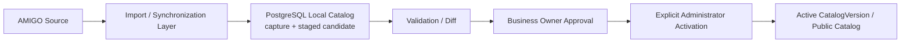
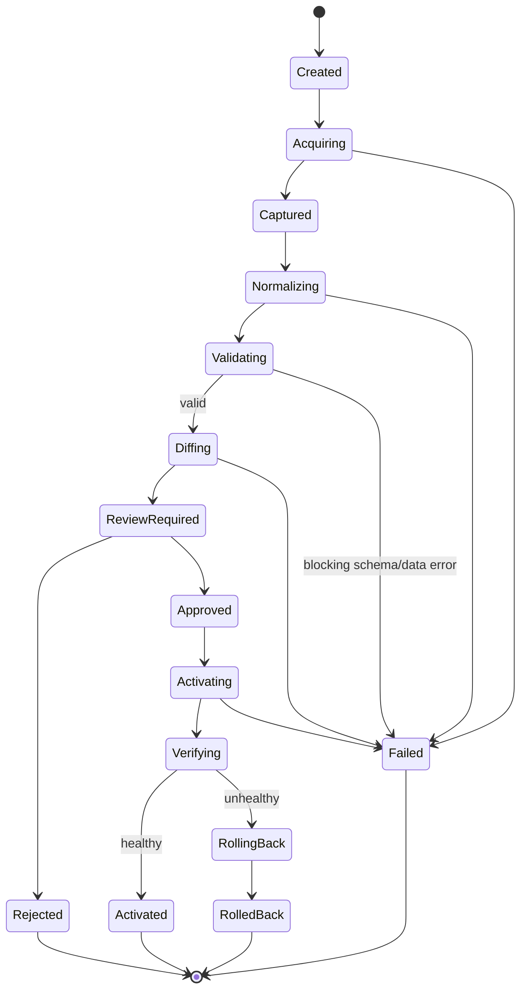

# AMIGO synchronization architecture PROJECT_NAME

## 0. Метаданные

| Поле | Значение |
|---|---|
| Статус | Phase 0C `READY_WITH_NON_BLOCKING_TBD` for Foundation; Phase 1B data capture is blocked until `TBD-SOURCE-AMIGO-002` has authorized transport/evidence |
| Версия | 0.4.0 |
| Дата | 2026-08-02 |
| Source registry | [EXTERNAL_SOURCES.md](../../00-global/EXTERNAL_SOURCES.md) |
| Pricing policy | [PRICING_SOURCE_POLICY.md](../../00-global/PRICING_SOURCE_POLICY.md) |

## 1. Purpose and boundaries

Sync architecture safely captures authorized AMIGO catalog/technical/price/media metadata into immutable PostgreSQL-backed staging, normalizes and diffs it, obtains Business Owner approval, records explicit administrator activation, atomically publishes local versions and rolls back. Public flows consume only the active approved local version. This specification does not assume a public API or authorize Phase 1B import/media acquisition.

## 2. Transport priority and evidence

Production transport is selected only with permission/evidence and ADR in this order:

1. official partner API;
2. partner cabinet/export;
3. official AMIGO export;
4. authorized catalog/price file;
5. explicitly permission-verified public-page import;
6. controlled manual admin import.

Public browser research and volatile customizer DOM/iframe are not a production transport by default. Credentials, rate limits, schemas, allowed fields/media and revocation/contact must be recorded per adapter.

## 3. Нормативные requirements

- **SYNC-ARCH-001 — MUST:** every run pins source record, transport/version/context/region/capture time and permission scope.
- **SYNC-ARCH-002 — MUST:** raw capture is immutable/hash-addressed/evidence-linked and never directly published.
- **SYNC-ARCH-003 — MUST:** normalization is deterministic/versioned and preserves raw/source labels/IDs alongside normalized values.
- **SYNC-ARCH-004 — MUST:** source entities match by stable source identity/mapping, not title/slug alone.
- **SYNC-ARCH-005 — MUST:** schema drift, duplicate identity, ambiguous mapping or invalid hierarchy quarantines affected records.
- **SYNC-ARCH-006 — MUST:** diff classifies additions, modifications, moves/renames, removals, conflicts and unchanged records at field/relationship/asset/price level.
- **SYNC-ARCH-007 — MUST:** diff severity/impact identifies public/config/price/media/history effects and exact approval roles.
- **SYNC-ARCH-008 — MUST:** publication, availability, pricing and orderability changes remain independent; source presence never activates all.
- **SYNC-ARCH-009 — MUST:** price capture/version/activation follows pricing policy and is not mixed with catalog activation unless one atomic approved release explicitly groups them.
- **SYNC-ARCH-010 — MUST:** media metadata/source asset may be staged, but actual file import later requires permission, integrity, mapping and media pipeline; no hotlink.
- **SYNC-ARCH-011 — MUST:** dry run performs full capture/normalize/validate/diff without changing active pointers.
- **SYNC-ARCH-012 — MUST:** activation consumes an immutable approved candidate/diff and switches typed active pointers atomically/idempotently.
- **SYNC-ARCH-013 — MUST:** post-activation health verifies expected counts/invariants/search/cache/price mappings; failure triggers approved rollback/compensation.
- **SYNC-ARCH-014 — MUST:** rollback restores prior active pointers/cache/delivery consistency but retains failed capture/candidate/diff/audit.
- **SYNC-ARCH-015 — MUST:** source outage/failure leaves current active local version untouched and updates freshness/run status.
- **SYNC-ARCH-016 — MUST:** removals retire/hide new selection by approved policy and never physically remove data needed by historical quote/order.
- **SYNC-ARCH-017 — MUST:** retries/resume are idempotent by run/stage/artifact hashes and cannot duplicate versions/activation.
- **SYNC-ARCH-018 — MUST:** future sync checks run automatically once daily and manually on admin request; data older than 7 days receives `STALE_WARNING`, and data older than 30 days requires admin verification before publishing a changed price or new product.
- **SYNC-ARCH-019 — MUST:** adapter/parser runs least privilege, bounded resource/egress/rate and does not bypass authorization/CAPTCHA/closed interfaces.
- **SYNC-ARCH-020 — MUST:** telemetry/audit excludes credentials/raw confidential files/media contents and records safe run/version/count/error metadata.
- **SYNC-ARCH-021 — MUST:** an AMIGO availability value is a proposal only; activation never overwrites confirmed local availability automatically.
- **SYNC-ARCH-022 — MUST:** the import contract declares field authority before normalization: AMIGO owns product, material, technical-data, catalog-image identity and base-price fields; Business Owner owns availability, local visibility/publication, local price overrides, local portfolio and commercial conditions.
- **SYNC-ARCH-023 — MUST:** acquisition/normalization/diff may create or revise only `AMIGO_SOURCE` values and proposals. It MUST NOT create, overwrite, clear or retire a `BUSINESS_OWNER_LOCAL` value; an attempted cross-authority change is a blocking conflict.
- **SYNC-ARCH-024 — MUST:** candidate/active data and local overlays are stored in PostgreSQL as separate revisions/relations with provenance and audit; no last-write-wins column merge is permitted.
- **SYNC-ARCH-025 — MUST:** image discovery/import writes source/asset metadata and object references to PostgreSQL while binary originals/derivatives go through managed object storage/media pipeline. Database persistence alone does not satisfy rights, mapping or publication gates.
- **SYNC-ARCH-026 — MUST:** the canonical `OWNER-DECISION-009` pipeline is `AMIGO Source → Import/Synchronization Layer → PostgreSQL Local Catalog → Validation/Diff → Business Owner Approval → Public Catalog through explicit administrator activation`; a run cannot publish by writing staging rows, a cache or a search index.
- **SYNC-ARCH-027 — MUST:** every source addition/change/removal is represented in a candidate and exact diff before any active pointer changes. Raw capture, incomplete candidate and rejected/unapproved diff MUST NOT be exposed to catalog, search, filters, configurator, calculations, leads or analytics.
- **SYNC-ARCH-028 — MUST:** Business Owner approves local public composition/visibility; an actor with publication activation capability explicitly activates the exact approved checksum. Governance approval and system permission are both recorded and are not inferred from one role name.
- **SYNC-ARCH-029 — MUST:** import MUST NOT automatically delete, clear, hide, archive or retire local entities, local-only data, Business Owner overlays or historical references. A source removal creates a source tombstone/proposal and reviewed diff; local lifecycle changes remain separate commands.
- **SYNC-ARCH-030 — MUST:** applicable approved local overrides have declared precedence in the composed public projection while immutable AMIGO values remain unchanged. Override conflicts, expiry or ambiguous scope block affected activation.
- **SYNC-ARCH-031 — MUST:** capture/import, validation, diff creation/resolution, override, approval, rejection, activation, hide/archive, rollback and derived-projection rebuild produce audit records with actor/workload, timestamp, reason, version references and correlation ID.
- **SYNC-ARCH-032 — MUST:** every candidate and published `CatalogVersion` has a unique ID, `createdAt`, nullable `publishedAt`, source/source-version manifest, capture/sync/diff checksums, approval/activation references, predecessor and rollback target. Published content is immutable; corrections create a new version.

## 4. Pipeline stages

The state machine below governs one run inside this data flow. Only the final active version may feed public or derived read paths.

Cancellation is allowed before activation subject to artifact retention. After activation starts, cancellation becomes complete-or-rollback command, not abandoned partial state.

## 5. Capture contract

Capture manifest fields: `captureId`, source/transport adapter/version, permission relationship/scope, source catalog/context/region, initiated actor/schedule, started/completed, source version markers/ETag/checksum where available, raw artifact refs/hashes/counts, media metadata presence, parser version, declared field-authority map, warnings/errors and classification.

Manual import also records uploader, original authorized file/hash, declared source/effective context and dual review if required. Manual does not reduce provenance requirements.

## 6. Normalization and mapping

Normalize into staged source model with explicit raw-to-normalized field mapping, authority class and transformation version. Preserve unknown fields/values safely for review; do not coerce unseen source price categories into 1–5. Units/locale/decimal/date conversion is explicit and loss-checked. Business Owner overlays are joined only in the local projection/readiness step and never copied into the AMIGO capture.

Mapping resolution order: exact stored source ID mapping → versioned alias → human-reviewed candidate; title similarity can suggest only and never auto-merge. Parent/type change, split/merge and reused source ID are blocking conflicts.

## 7. Validation layers

1. Artifact integrity/size/type/encoding and adapter authenticity.
2. Schema required fields/types/unknown handling.
3. Identity uniqueness and hierarchy acyclicity.
4. Relationship/cardinality/referential integrity.
5. Domain allowed values with dynamic safe extension.
6. Material/property/category/option/constraint mapping consistency.
7. Price exactness/currency/context/version/rule coverage.
8. Media metadata/source link/permission and no hotlink publication.
9. Readiness/publication/rights gates.
10. Historical impact and deletion/retirement protection.

Validation emits per-record codes/severity and aggregate blocking/nonblocking report. Thresholds are owner/policy decisions, not hidden parser defaults.

## 8. Difference model

`CatalogSyncDifference`: entity/mapping IDs, type (`ADD`, `MODIFY`, `RENAME`, `MOVE`, `REMOVE`, `CONFLICT`, `UNCHANGED`), field/relationship, before/after source/local refs, normalized/raw values safe, severity, affected capabilities/states/history, recommended action, resolution/status/actor/reason and validation links.

Summary counts never replace full diff. Price/media/rights changes are flagged critical. A large removal percentage or schema/category explosion triggers mandatory review without hardcoded unapproved threshold; threshold is configurable/ADR/policy.

## 9. Approval and activation

Approval matrix:

- catalog mapping/readiness → catalog capability;
- price version/rules/overrides → price editor + approver policy;
- media rights/publication → content/right approvers;
- partner scope → owner;
- security/schema/transport changes → technical/security owner/ADR.

Business Owner approval determines local public composition/visibility. The administrator publication action records an actor with the exact activation capability; the same human MAY satisfy both only when both governance authority and system permission are independently present and audited. Approval binds exact candidate/diff checksums; any change invalidates approval. Activation command lists pointers/entities/version/effective time/rollback target, actor/approvals and idempotency. It uses transaction or equivalent strongly consistent cutover and publishes version-pinned cache/search/filter/analytics rebuild events afterward.

## 10. Price synchronization boundary

Catalog run MAY carry source price metadata, but price candidate is independently staged/validated/parity-tested/approved. `sourcePriceCategory` dynamic strings are preserved. Active price version and catalog version compatibility is declared. Approved Business Owner price overrides compose after the immutable AMIGO base-price layer and have priority only in their declared scope. No partial price table or unverified public `от` value becomes active calculator data.

## 11. Media synchronization boundary

Sync may discover asset identifiers/URLs/metadata within permission. It creates `SourceAsset` candidates only. Later file acquisition uses approved controlled media pipeline, records hash/right/mapping/derivatives and never hotlinks. Existing public asset remains until revoke/update approval; wrong mapping triggers immediate block/impact.

## 12. Scheduling, concurrency and idempotency

Only one activation per target context/pointer set at a time. Multiple captures may run, but candidate base version recorded; stale-base approval/activation conflicts and requires re-diff. Run/stage artifact IDs/checksums enable resume. Scheduled vs manual trigger and priority do not skip same validation.

Cadence and staleness are fixed by `OWNER-DECISION-005`: daily + manual, 7-day warning, 30-day verification gate. Retry limits, concurrency budgets and exact scheduler remain implementation evaluation. Backoff honors source terms/rate. Manual run uses the same pipeline/audit.

## 13. Failures and edge cases

| Case | Required result |
|---|---|
| Unauthorized/expired partner access | Stop capture, alert owner; active local remains |
| Source version marker missing | Generate capture checksum/version label; lower confidence/review |
| Partial/truncated file | Integrity/count/schema failure; no candidate activation |
| Encoding/locale/decimal change | Blocking conversion/schema drift |
| Duplicate/reused source ID | Quarantine conflict |
| Rename/move | Alias/mapping revision; stable local ID |
| Source or mass removal | Source tombstone + high-impact diff; never automatic local hide/archive/delete and never hard-delete history/overlays |
| New category/property/price category | Preserve dynamically; schema/mapping/readiness review |
| Active base changed during review | Approval invalid/stale, re-diff |
| Cache/search update failure | Active source of truth remains; retry/health/rollback policy |
| Activation partial failure | Atomic rollback/compensation, critical alert |
| Rollback repeated | Idempotent prior pointer result |

## 14. Security, privacy, performance and observability

Adapter credentials in secret store, egress allowlist, safe parser isolation, file size/decompression/malware defenses, no browser credential automation without approval. AMIGO customer data is outside scope and rejected/quarantined. Work is bounded/streamed/batched and isolated from public/AI queues. Metrics: run/stage latency, bytes/records safe counts, diff types/severity, validation errors, approval age, freshness, activation/rollback and rate responses; logs use IDs/checksums, not raw confidential payload.

## 15. Acceptance and tests

Primary: `AC-AMIGO-SYNC-001`, `AC-SYNC-DIFF-001`, `AC-SYNC-ROLLBACK-001`, `AC-CATALOG-DYNAMIC-001`, `AC-PRICE-ACTIVATE-001`, `AC-ASSET-MAP-001`.

Tests: every transport via authorized fixture; integrity/schema/encoding/locale; dynamic category/property/category string; rename/move/split/merge/reused ID; field/relationship/price/media diff; direct AMIGO/staging public-read denial; source-removal preservation of local data/overlays/history; override precedence without source mutation; Business Owner + activation-capability evidence; catalog-version source/timestamp/audit completeness; approval checksum invalidation; stale-base concurrency; dry run/no pointer change; atomic activation/version-pinned cache/search/filter/analytics rebuild; post-health/rollback; retry/resume/idempotency; source/auth/rate outage; telemetry/secret scan; historical retention.

## 16. Dependencies, risks and open questions

Dependencies: catalog/pricing/media/admin/data/API/security/observability/deployment, ADR-0002 and `OWNER-DECISION-008/009`. Open: transport/export/schema/sample, permission details, source region/context, rate limits, retry/concurrency, change markers, media acquisition and activation grouping. Cadence/staleness, local availability authority and public-serving topology are resolved by `OWNER-DECISION-004/005/009`; actual transport/data/import remain gated. Risks: volatile DOM, secret exposure, direct staging exposure, auto-publication, destructive removal, override loss, price mismatch, parser drift, approval of moving candidate, derived-projection drift and rollback inconsistency.

## 17. History

| Версия | Дата | Изменение |
|---|---|---|
| 0.1.0 | 2026-08-02 | Defined transport priority, immutable capture, normalization/validation/diff, approval/activation/rollback, price/media boundaries and tests. |
| 0.2.0 | 2026-08-02 | Зафиксированы daily/manual cadence, `STALE_WARNING`, 30-day verification gate и запрет auto-overwrite локального наличия; реализация sync остаётся Phase 1B+. |
| 0.3.0 | 2026-08-02 | Added field-level authority, PostgreSQL source/local revision separation and object-storage image import boundary from `OWNER-DECISION-008`; transport/import evidence remains gated. |
| 0.4.0 | 2026-08-02 | Applied `OWNER-DECISION-009`: PostgreSQL active `CatalogVersion` is the only public-serving source; added exact owner/admin pipeline, no-auto-delete, override precedence, full audit/version metadata and version-pinned derived rebuilds. |
