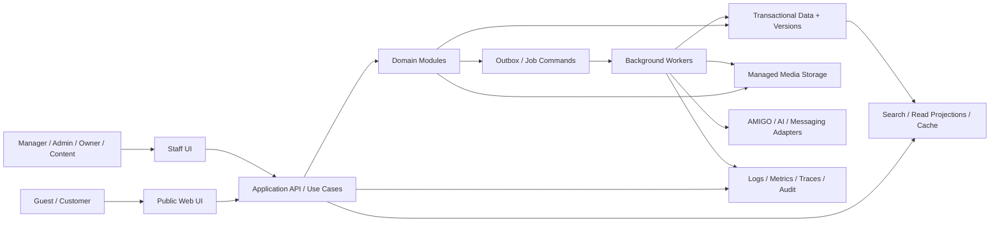
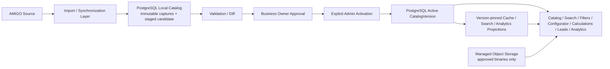

# Application architecture specification PROJECT_NAME

## 0. Метаданные

| Поле | Значение |
|---|---|
| Статус | Phase 1A Foundation implemented and verified; feature/production topology remains gated |
| Версия | 0.4.0 |
| Дата | 2026-08-02 |
| Global baseline | [GLOBAL_SPEC.md](../GLOBAL_SPEC.md) 0.9.0 |
| Decisions | [docs/adr](../../adr/) |

## 1. Назначение and boundaries

Architecture defines logical components, trust/data boundaries, synchronous/asynchronous responsibilities, provider adapters, availability/degradation and evolutionary constraints. It does not select framework, language, cloud, database, queue, object storage, auth or AI provider.

## 2. Architectural drivers

1. Dynamic authorized AMIGO catalog with local snapshots and no critical runtime dependency.
2. Reproducible money/history and controlled price activation.
3. Exact material/product identity across catalog, standard preview and private AI visualization.
4. Private photo processing, short-lived access and deletion graph.
5. Guest-first funnel plus staff RBAC/audit.
6. Sync/diff/approval/rollback and media rights governance.
7. Mobile/accessibility/performance and local WhatsApp/manual fallback.
8. Provider/vendor replaceability until formal ADR.
9. Field-level authority: AMIGO source data and Business Owner local decisions share one PostgreSQL operational plane without overwriting one another.
10. One public-serving catalog truth: active approved PostgreSQL `CatalogVersion`, never live AMIGO or unapproved staging.

## 3. Нормативные requirements

- **ARCH-SPEC-001 — MUST:** product is separated into domain modules with explicit contracts: Catalog, Configuration, Pricing, Preview, Visualization, Cart/Orders, Identity, Content/Media, Sync, Admin/Audit.
- **ARCH-SPEC-002 — MUST:** public web/API never treats live AMIGO as a critical request-path dependency; it reads active local projections/versions.
- **ARCH-SPEC-003 — MUST:** external integrations are behind replaceable adapters with timeouts, retries/circuit breakers, typed errors and audit.
- **ARCH-SPEC-004 — MUST:** immutable source/price/configuration/quote/media/job revisions are distinct from mutable active pointers/read models.
- **ARCH-SPEC-005 — MUST:** transactional state change and its external side effects use an outbox/equivalent durable pattern; retries are idempotent.
- **ARCH-SPEC-006 — MUST:** long-running sync/media/AI/export/delete tasks execute asynchronously and expose job state/cancel/retry where allowed.
- **ARCH-SPEC-007 — MUST:** user-photo storage/processing is a private trust zone separate from public catalog/media delivery.
- **ARCH-SPEC-008 — MUST:** client and admin UI do not contain partner/provider credentials, proprietary rule internals or direct object-storage authorization.
- **ARCH-SPEC-009 — MUST:** authorization is enforced at application/domain boundaries for actor, capability, object and transition; UI hiding is insufficient.
- **ARCH-SPEC-010 — MUST:** critical mutations are audited with correlation/command ID; audit failure behavior is explicit.
- **ARCH-SPEC-011 — MUST:** versioned APIs/events/storage formats support backward-compatible rolling change and historical replay.
- **ARCH-SPEC-012 — MUST:** cache keys include all behavior-affecting versions; invalidation/revocation prevents stale public/price/media exposure.
- **ARCH-SPEC-013 — MUST:** source/AI/analytics/WhatsApp outage preserves local catalog, saved history and manual contact path.
- **ARCH-SPEC-014 — MUST:** secrets, private URLs/media and sensitive metadata are excluded from telemetry by schema/redaction, not convention alone.
- **ARCH-SPEC-015 — MUST:** chosen infrastructure supports backup/restore, deletion/retention, regional access testing, observability and exit/rollback.
- **ARCH-SPEC-016 — MUST:** architecture remains single-business/simple by default but IDs/ownership prevent future data collision; speculative multi-tenancy is not implemented.
- **ARCH-SPEC-017 — MUST:** production technology/hosting/provider choices require evaluation/ADR and may not be inferred from document examples.
- **ARCH-SPEC-018 — MUST:** health/readiness checks distinguish process alive from dependencies/data versions ready; public catalog can degrade independently from AI/sync.
- **ARCH-SPEC-019 — MUST:** PostgreSQL is the local transactional operational system of record for source captures, normalized catalog projections, local overlays, active pointers and audit; it is not authority to redefine AMIGO-origin or Business Owner-owned values.
- **ARCH-SPEC-020 — MUST:** source-owned fields (AMIGO products, materials, technical data, catalog-image identity and base prices) and local-owned fields (availability, visibility/publication, price overrides, portfolio and commercial conditions) use separate version/provenance/mutation paths; cross-layer last-write-wins is prohibited.
- **ARCH-SPEC-021 — MUST:** AMIGO image metadata, provenance, mapping, rights/publication state and object references MAY reside in PostgreSQL, while binary originals/derivatives MUST remain in managed object storage under ADR-0006/0009.
- **ARCH-SPEC-022 — MUST:** documenting the PostgreSQL target and authority matrix does not assert an existing catalog schema/import or authorize Phase 1B; implementation still follows roadmap entry gates and reviewed migrations.
- **ARCH-SPEC-023 — MUST:** by `OWNER-DECISION-009`, the public application MUST NOT read AMIGO, raw captures or staged candidates directly. Client catalog, search, filters, configurator, calculations, leads and analytics use PostgreSQL active approved catalog/transactional state as their only canonical runtime source.
- **ARCH-SPEC-024 — MUST:** cache, search index, filter facets, analytics datasets and other read projections MAY serve requests only when derived from and pinned to an exact active `CatalogVersion`; they are rebuildable/disposable and cannot accept AMIGO directly or become a mutation authority.
- **ARCH-SPEC-025 — MUST:** every AMIGO change follows `source capture → import/synchronization → PostgreSQL staged local catalog → validation/diff → Business Owner approval → explicit administrator activation → public catalog`. No adapter, worker, cache or admin shortcut may bypass a stage.
- **ARCH-SPEC-026 — MUST:** import/source removal MUST NOT automatically delete, clear, hide or retire a local entity, local-only record, Business Owner overlay or historical reference. It creates a reviewed difference/proposal; any local lifecycle transition is an explicit audited command.
- **ARCH-SPEC-027 — MUST:** applicable local overrides take precedence when composing the public projection, without mutating immutable AMIGO source values. Precedence is typed, scoped, versioned, effective-dated and conflict-checked rather than last-write-wins.
- **ARCH-SPEC-028 — MUST:** every catalog version and lifecycle mutation records source/source-version manifest, timestamps, capture/sync/diff, approvals, activation actor, audit correlation, predecessor and rollback target; published versions are immutable.

## 4. Logical context

Names are logical roles, not deployment units. They MAY be one deployable modular application plus workers initially; service extraction requires measured need and ADR.

### 4.1. Public catalog serving path

Only `ACTIVE` is catalog truth for runtime decisions. `DERIVED` is rebuildable from that version; object storage delivers approved bytes referenced by it. Neither layer may ingest AMIGO independently.

## 5. Module boundaries

| Module | Owns | Consumes / emits |
|---|---|---|
| Catalog | Source/local entities, mappings, readiness, compatibility | Sync/media/price refs; catalog-version events |
| Configuration | Draft/revisions and validation evidence | Catalog/schema/rules; valid revision events |
| Pricing | Versions/rules/overrides/quotes/parity | Valid config; quote/version events |
| Standard Preview | Scene/product/material profiles and outputs | Config/catalog/media; preview events |
| Visualization | Private photo/geometry/masks/jobs/revisions/deletion | Config/media/AI adapters; private events |
| Cart/Orders | Project/cart/handoff/lead/measurement/order/warranty | Config/quote/preview/account; state events |
| Identity/RBAC | Accounts/sessions/guest ownership/capabilities | Authorization decisions/audit |
| Content/Media | Content/assets/rights/publication/derivatives | Catalog/partner; revoke/publication events |
| Sync | Captures/runs/diffs/activation/rollback commands | External adapter; staged/active events |
| Admin/Audit | Use-case orchestration, approvals/read models/audit | All modules via explicit application interfaces |

Modules do not reach into another module's tables/objects as an implicit API. Cross-module references use stable IDs/revisions; transaction scope is explicit.

## 6. Command/query/event model

Commands express intent and carry actor/object/current version/idempotency/reason. Domain validates and commits aggregate state plus outbox event. Queries read authorized projections with freshness/version. Events are immutable facts with schema/version and no secrets/private payload; consumers deduplicate by event ID.

Events are not used to hide strong consistency requirements: price activation pointer, quote creation, project claim, rights revoke and state transition require atomic domain decision. Search/cache/notifications/analytics may update asynchronously with visible freshness.

## 7. Synchronous request path

Typical public request: edge/gateway protection → session/guest context → application use case → authorization/input validation → domain/query → response DTO → telemetry. Heavy rendering/source calls are not performed inline. Quote calculation MAY be synchronous if bounded/deterministic; otherwise job contract must preserve one version and clear progress.

Admin mutation: staff auth/step-up → exact capability/object/version → impact/command validation → transaction/outbox/audit → accepted result/command status. External effect follows asynchronously.

## 8. Background job model

Job envelope: `jobId`, type/schema version, tenant/business scope, actor/purpose, aggregate/revision refs, idempotency key, priority, created/scheduled/deadline, attempt/max policy, state, correlation/causation, input refs, output refs, cancellation/deletion flags and redacted failure.

Workers lease jobs, heartbeat bounded tasks, commit outputs atomically/idempotently and avoid processing after delete/revoke. Retry only transient classes with backoff/jitter; permanent/data/security failures stop and require action. Dead-letter is an operational state with runbook, not data disposal.

## 9. External adapters

| Adapter | Required boundary |
|---|---|
| AMIGO source | Approved transport, capture/version/context, credentials isolation, no runtime public dependency |
| Pricing provider | `resolve/validate/calculate/explain/parity`; immutable version contract |
| AI/CV/refinement | Job-scoped private input, model/version, no training, timeout/delete/late callback controls |
| Object storage/media delivery | Private/public namespaces, signed authorization, integrity, derivatives, revoke/delete |
| WhatsApp | Deep-link/share-safe payload; future API requires contract/consent/idempotency |
| Auth | Standards-based adapter; account/object authorization remains local |
| Analytics | Consent/minimal event schema; product works when unavailable |

## 10. Data and storage boundaries

PostgreSQL stores domain revisions/relationships, immutable AMIGO captures, staged candidates, immutable published `CatalogVersion` records, normalized local catalog projections, Business Owner overlays, active pointers and minimal PII. Object storage holds originals/derivatives with metadata and opaque object references in PostgreSQL. Search/filter/cache/analytics projections are rebuildable from an exact active catalog version and never the authority for mutations. Audit is immutable/tamper-evident by controls. Backups map data classes and deletion/restore procedures.

No local file-system dependency is assumed for production. Storage/database vendors and topology are `TBD-INFRA-*`/ADR.

## 11. Security and privacy architecture

Trust zones: public edge, authenticated customer, privileged staff, application/domain, background workers, public approved media, private user media, external providers and operations. Least privilege/network egress/secret isolation apply. Private media uses direct upload only through authorized short-lived grant or controlled proxy; completion validates object/hash/owner. Staff/public deliveries are separate.

Threat model covers IDOR/BOLA, upload/parser abuse, XSS/CSRF, SSRF/egress, job poisoning/replay, signed URL leakage, prompt/provider data leakage, role/approval bypass, source credential exposure and supply-chain risk.

## 12. Availability and degradation matrix

| Failure | Remains available | Fails/changes safely |
|---|---|---|
| AMIGO/source transport | Active local catalog/history/contact | Sync freshness/updates alert |
| Pricing provider/engine | Catalog/config/cart draft/manual | Numeric quote unavailable, no fake zero |
| Public media | Text/catalog identity/contact | Broken asset hidden/fallback, no hotlink |
| Standard renderer | Config/price/cart/contact | Static/text preview fallback |
| AI/CV/refinement | Standard preview/base/manual/contact | Stage failure/retry; no private leak |
| Auth provider | Public/guest/manual path | Account/staff/high-risk operations fail safe |
| WhatsApp | Cart/project/reference/contact display | Deep link/message status explicit |
| Analytics | Full product behavior | Events buffer/drop per policy |
| Search projection | Authoritative detail/basic browse if designed | Staleness shown/rebuild |
| Audit/outbox | Reads; low-risk policy-specific | Critical mutation fails closed/durable outbox |

## 13. Performance and scalability principles

Optimize public shell/catalog separately from heavy visualizers. Use route/feature/media lazy loading, bounded queries/pagination, versioned caching, asynchronous transformations, queue isolation by workload, backpressure and resource quotas. Scale decisions follow measurements; no microservice/service split is justified by fashion. Numeric budgets live in `PERFORMANCE.md`.

## 14. Observability and operations

Every request/job/command carries correlation/causation and safe version identifiers. Metrics cover latency/error/saturation/freshness/queue/cost/quality/business state. Logs are structured/redacted. Alerts link owner/runbook and avoid private payload. Deployment includes migrations/backward compatibility, health gates, canary/rollback and restore drills.

## 15. Validation, errors and edge cases

- mixed source/catalog/price/asset revisions rejected or pinned explicitly;
- duplicate command/event/job/callback deduplicated;
- out-of-order event cannot regress aggregate state;
- stale read model revalidates authoritative version before mutation;
- asset/permission revoke during AI/render/public delivery blocks output;
- deletion race/late callback cannot resurrect media;
- time-zone/effective-date uses authoritative UTC + business display timezone;
- cache/search/worker partial outage has rebuild/retry/rollback;
- rolling deployment supports old/new event/API/data versions;
- restore does not silently republish revoked/deleted/stale state.

## 16. Acceptance criteria and tests

Architecture acceptance is covered by domain AC plus contract/component/integration/failure/recovery/security tests in `TEST_STRATEGY`. Required architecture tests: adapter outage, no live AMIGO/staging dependency, exact active-version pinning of public and derived reads, source-removal no-auto-delete, override precedence without source mutation, approval/activation authorization, version/audit completeness, rollback, outbox atomicity, job idempotency/cancel/delete, mixed-version rejection, cache invalidation, role/object checks, secret/private telemetry scan, rolling compatibility and backup/restore.

## 17. Phase 1A implementation record

Implemented topology matches ADR-0007–0010: Next.js same-origin web/BFF, separate Node worker, PostgreSQL/Prisma, Graphile Worker, S3-compatible and identity ports, shared contracts/config/observability/testing packages and automated acyclic dependency direction. Only technical shell and synthetic Foundation behavior exist; no feature module or production topology was added. Evidence: [Phase 1A report](../../06-plans/completed/PHASE_1A_FOUNDATION_REPORT.md).

## 18. Dependencies, risks and open questions

Dependencies: all specs, ADR/evaluations, data/API/sync/media/AI/storage/security/performance/observability/deployment and `OWNER-DECISION-008/009`. Foundation runtime/framework/database/queue boundaries are fixed by ADR-0007–0010; open: production object/auth/telemetry/hosting providers, search, AI, region/network and RPO/RTO. `OWNER-DECISION-009` composes the already accepted ADR-0002 local-active read path with ADR-0008 PostgreSQL persistence; it does not approve a transport, search product or business schema. Risks: premature microservices, distributed inconsistency, provider lock-in, hidden live-source/staging dependency, derived-projection drift, destructive import, privacy boundary collapse and untestable recovery.

## 19. История изменений

| Версия | Дата | Изменение |
|---|---|---|
| 0.1.0 | 2026-08-02 | Defined vendor-neutral modular architecture, boundaries, commands/events/jobs, adapters, degradation and operational constraints. |
| 0.2.0 | 2026-08-02 | Recorded Phase 1A implementation conformance and resolved Foundation stack/topology unknowns while retaining production provider gates. |
| 0.3.0 | 2026-08-02 | Added `OWNER-DECISION-008` authority boundaries, PostgreSQL operational projection and object-storage image binary split without claiming Phase 1B implementation. |
| 0.4.0 | 2026-08-02 | Applied `OWNER-DECISION-009`: active approved PostgreSQL `CatalogVersion` is the only public-serving runtime truth; added version-pinned derived projections, mandatory source→diff→owner/admin activation, no-auto-delete, override precedence, audit and rollback boundaries. |
